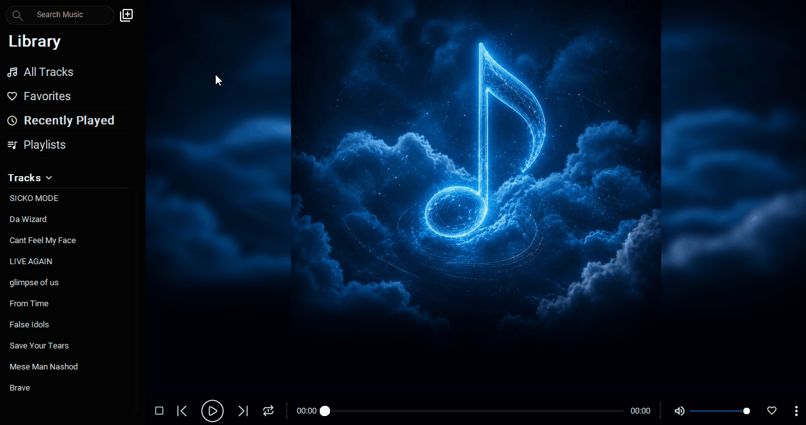

# 🎵 Music Library Manager

>📌 بخشی از مسیر Music Engineering Journey     
>https://github.com/amin-soleimani1/music-engineering-journey

🌐 **زبان**: فارسی | [English](README.md)


## فاز ۲ — اپلیکیشن دسکتاپ مبتنی بر پایگاه داده

 یک اپلیکیشن دسکتاپ مدیریت کتابخانه موسیقی که با استفاده از Python، CustomTkinter و SQLite ساخته شده است.

این پروژه نسخه دوم از پروژه اولیه Music Player است. در نسخه اول تمرکز اصلی روی یادگیری مبانی رابط کاربری بود، اما در این نسخه پروژه بازطراحی شد تا مفاهیمی مثل معماری نرم‌افزار، کار با دیتابیس، ریفکتور کردن کد و ساخت یک اپلیکیشن ساختار یافته‌تر بررسی شود.

## 🔗 مسیر پروژه

⬅️ **نسخه قبلی**
[Music Player Basic](https://github.com/amin-soleimani1/music-player-basic)     
➡️ **نسخه بعدی**
Music Management Platform (به‌زودی)

# توضیح
این پروژه یک پروژه آموزشی است که برای یادگیری طراحی نرم‌افزار، معماری برنامه‌ها و توسعه با پایتون ساخته شده و هدف آن تولید یک نرم‌افزار تجاری نیست.

| نسخه | تمرکز اصلی |
|----------|------------|
| 🎵 Music Player | توسعه رابط کاربری، پخش موسیقی، معماری اولیه |
| 📚 Music Library Manager | کار با SQLite، معماری MVC، ریفکتور کد، بهبود تجربه کاربری، ساختار ماژولار |

بجای شروع یک پروژه جدید، این پروژه با بهبود و بازطراحی نسخه قبلی ساخته شده تا تجربه واقعی‌تری از بهبود و توسعه یک کدبیس موجود ایجاد شود.

# 🖼 پیش‌نمایش
### رابط اصلی
<p align="center">  </p>

### بخش پلی‌لیست
<p align="center">  </p>

### دمو
<p align="center">  </p>

# ✨ قابلیت‌ها
## 🎼 کتابخانه موسیقی
- مشاهده تمام فایل‌های موسیقی 
- مدیریت خودکار کتابخانه بر اساس متادیتا
- ئپشتیبانی از کاور آلبوم
- نمایش اطلاعات خواننده و آهنگ
## ❤️ علاقه‌مندی‌ها
- امکان اضافه کردن آهنگ به لیست علاقه‌مندی
- بخش اختصاصی برای آهنگ‌های مورد علاقه
## 🕒 اخیراً پخش‌شده‌ها
- ثبت خودکار تاریخچه پخش آهنگ‌ها
- نمایش آهنگ‌های اخیر
## 📂 مدیریت پلی‌لیست
- ساخت پلی‌لیست‌های سفارشی
- ذخیره پلی‌لیست‌ها در دیتابیس SQLite
- مدیریت محتویات پلی‌لیست

## جستجوی هوشمند آهنگ
- 🔍 جستجوی آهنگ‌ها بر اساس نام
- جستجوی هوشمند (Fuzzy Search) که در صورت وارد کردن بخشی از نام آهنگ، نزدیک‌ترین نتیجه را پیشنهاد می‌دهد

## ▶ کنترل پخش
- پخش / توقف
- آهنگ قبلی / بعدی
- تکرار یک آهنگ
- تکرار کل پلی‌لیست
## 🖥 رابط کاربری
- طراحی مجدد کامل رابط کاربری
- بهبود تجربه کاربری
- ناوبری ساده‌تر
- ساختار ماژولارتر UI

# 🧠 معماری پروژه
این پروژه از ترکیب معماری MVC + لایه سرویس (Service Layer) استفاده می‌کند تا مسئولیت‌ها به شکل واضح از هم جدا شوند.

## 📦 مدل‌ها (Models)

لایه Models فقط شامل ساختار داده‌ها است.

این لایه شامل داده‌هایی مانند:

مدل آهنگ (Track)
مدل پلی‌لیست (Playlist)

در این لایه هیچ منطق برنامه یا عملیات دیتابیس وجود ندارد.

## ⚙️ هسته (Core)

لایه Core شامل منطق اصلی برنامه است، از جمله:

موتور پخش موسیقی
عملیات دیتابیس SQLite
منطق سطح برنامه

این لایه نقش سرویس (Service Layer) را در برنامه دارد.

## 🎮 کنترلر (Controller)

لایه Controller ارتباط بین رابط کاربری و Core را مدیریت می‌کند.

در این نسخه، کنترلر بازطراحی شده تا وابستگی‌ها کاهش پیدا کنند.

به جای استفاده از ایندکس‌های UI، عملیات‌ها بر اساس مسیر فایل موسیقی انجام می‌شوند که باعث کاهش وابستگی و افزایش نگهداری‌پذیری کد شده است.

## 🖼 رابط کاربری (View)

رابط کاربری با استفاده از CustomTkinter پیاده‌سازی شده است.

این لایه فقط مسئول:

نمایش اطلاعات
دریافت تعامل کاربر

است.

## 🧩 ابزارهای کمکی (Utils)

توابع کمکی در یک پوشه جداگانه قرار گرفته‌اند تا از تکرار کد جلوگیری شود و ساختار پروژه بهتر سازمان‌دهی شود.

## 🗄 دیتابیس

در این پروژه از SQLite برای ذخیره‌سازی اطلاعات استفاده شده است.

اطلاعات ذخیره‌شده شامل:

متادیتای موسیقی‌ها
مسیر فایل‌ها
آهنگ‌های مورد علاقه
تاریخچه پخش اخیر
اطلاعات پلی‌لیست‌ها

استفاده از دیتابیس امکان پیاده‌سازی قابلیت‌های پیشرفته‌تر و ذخیره‌سازی دائمی اطلاعات را فراهم کرده است.

# 🛠 تکنولوژی‌ها
- Python
- CustomTkinter
- CTklistbox
- SQLite     
- pygame
- Pillow
- music_tag

# 📁 ساختار پروژه
این پروژه از یک معماری ماژولار استفاده می‌کند که رابط کاربری، منطق برنامه، مدل‌های داده، دیتابیس و ابزارهای کمکی را از هم جدا می‌کند تا نگهداری و توسعه آن ساده‌تر شود.

```
Music Library Manager/
│
├── main.py                  # نقطه ورود برنامه
│
├── app/                     # لایه برنامه
│   ├── app.py               # مقداردهی اولیه برنامه
│   └── controllers.py      # کنترلرهای برنامه
│
├── core/                    # منطق تجاری (لایه سرویس)
│   ├── database.py          # عملیات دیتابیس
│   └── player.py            # موتور پخش موسیقی
│
├── models/                  # مدل‌های داده
│   ├── track.py             # مدل داده آهنگ
│   └── playlist.py          # مدل داده پلی‌لیست
│
├── ui/                      # رابط کاربری
│   └── main_window.py       # پنجره اصلی برنامه
│
├── utils/                   # توابع کمکی
│   └── file_utils.py        # مدیریت فایل‌ها
│
└── assets/                  # منابع ثابت
    ├── icons/               # آیکون‌های برنامه
    └── images/              # تصاویر آلبوم و رابط کاربری
```

# 📚 آنچه یاد گرفتم

این پروژه به عنوان یک تجربه یادگیری ساخته شد.

در طول توسعه، درک عمیق‌تری از موارد زیر به دست آوردم:

- طراحی دیتابیس و اهمیت ذخیره‌سازی پایدار
- استفاده عملی از SQLite در اپلیکیشن‌های دسکتاپ
- معماری MVC و لایه سرویس
- برنامه‌نویسی شیءگرا
- ریفکتور و بازطراحی کد
- نوشتن کد تمیزتر و قابل نگهداری‌تر
- ساختاردهی پروژه‌های متوسط
- استفاده از محیط مجازی Python (venv)
- بهبود تدریجی تجربه کاربری (UX)

مهم‌تر از همه، این پروژه به من یاد داد که توسعه نرم‌افزار فقط اضافه کردن قابلیت نیست، بلکه بهبود ساختار، خوانایی و نگهداری‌پذیری نیز بخش مهمی از آن است.

## پیش‌نیازها
- پایتون نسخه 3.10 یا بالاتر (تست‌شده روی نسخه‌های 3.10، 3.11 و 3.12)

# 🚀 نصب و اجرا

کلون کردن پروژه:
```bash
git clone git clone https://github.com/amin-soleimani1/Music-Library-Manager.git
```

ساخت محیط مجازی:
```bash
python -m venv .venv
```

نصب وابستگی‌ها:
```bash
pip install -r requirements.txt
```

اجرای برنامه:
```bash
python main.py
```
# 🔮 برنامه‌های آینده

این پروژه آخرین نسخه دسکتاپ این مسیر آموزشی است.

نسخه‌های آینده به سمت توسعه وب با استفاده از تکنولوژی‌های زیر حرکت خواهند کرد:

- FastAPI (بک‌اند)
- React (فرانت‌اند)
- PostgreSQL
- و قابلیت‌های مبتنی بر هوش مصنوعی در مراحل بعدی
# 📄 لایسنس

این پروژه برای اهداف آموزشی منتشر شده است.

می‌توانید آزادانه کد را بررسی کرده و از ایده‌های آن در مسیر یادگیری خود استفاده کنید.
